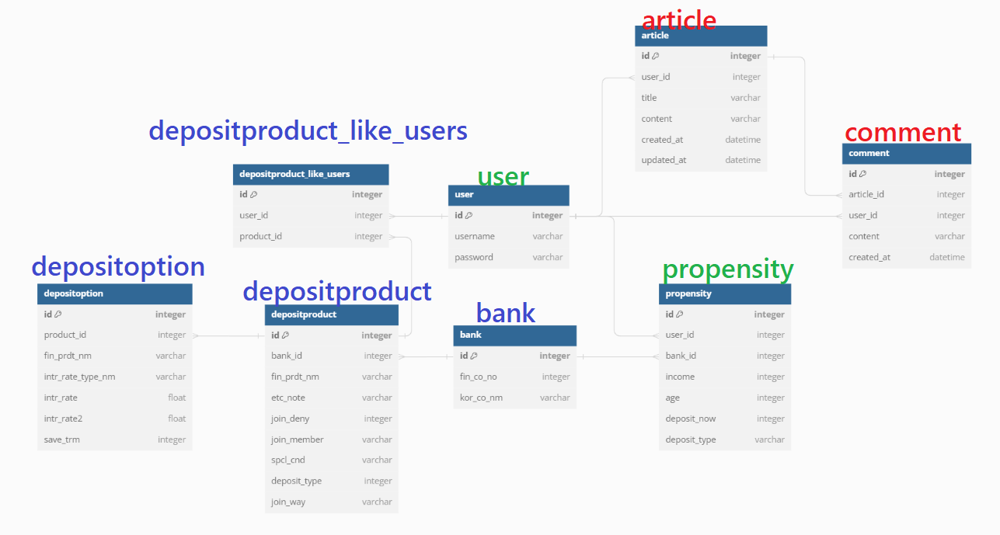
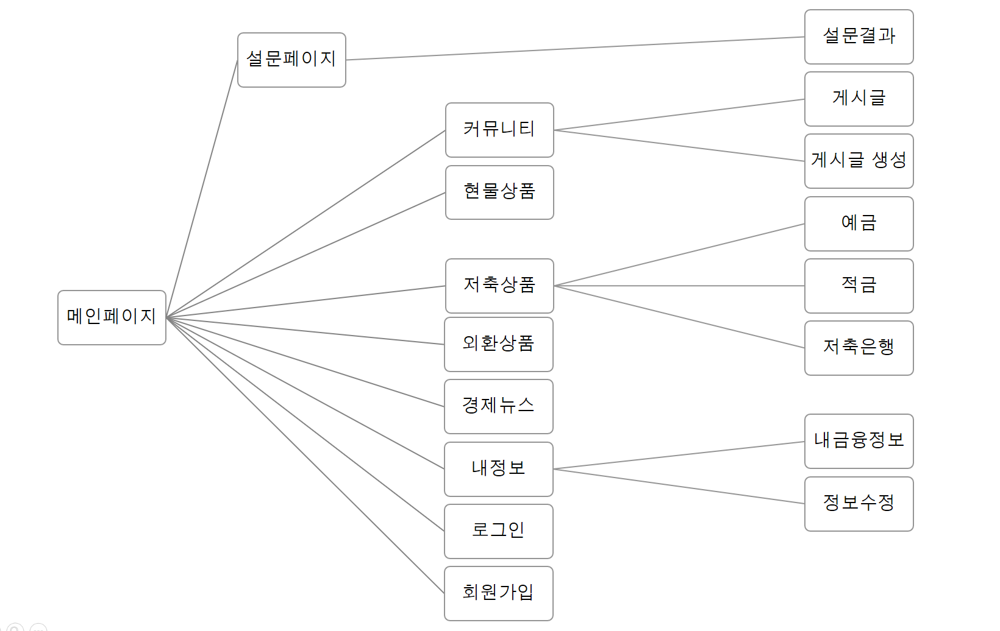
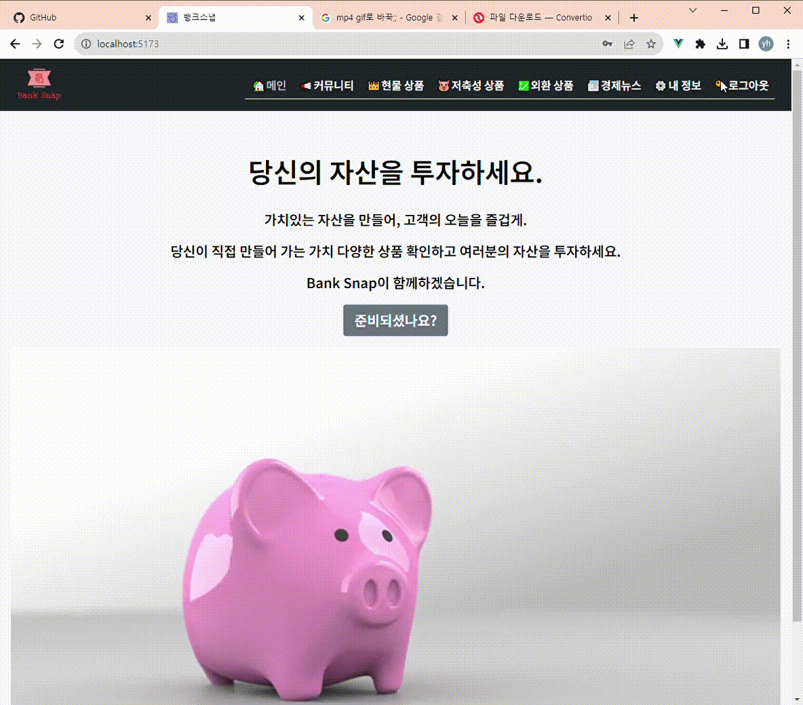
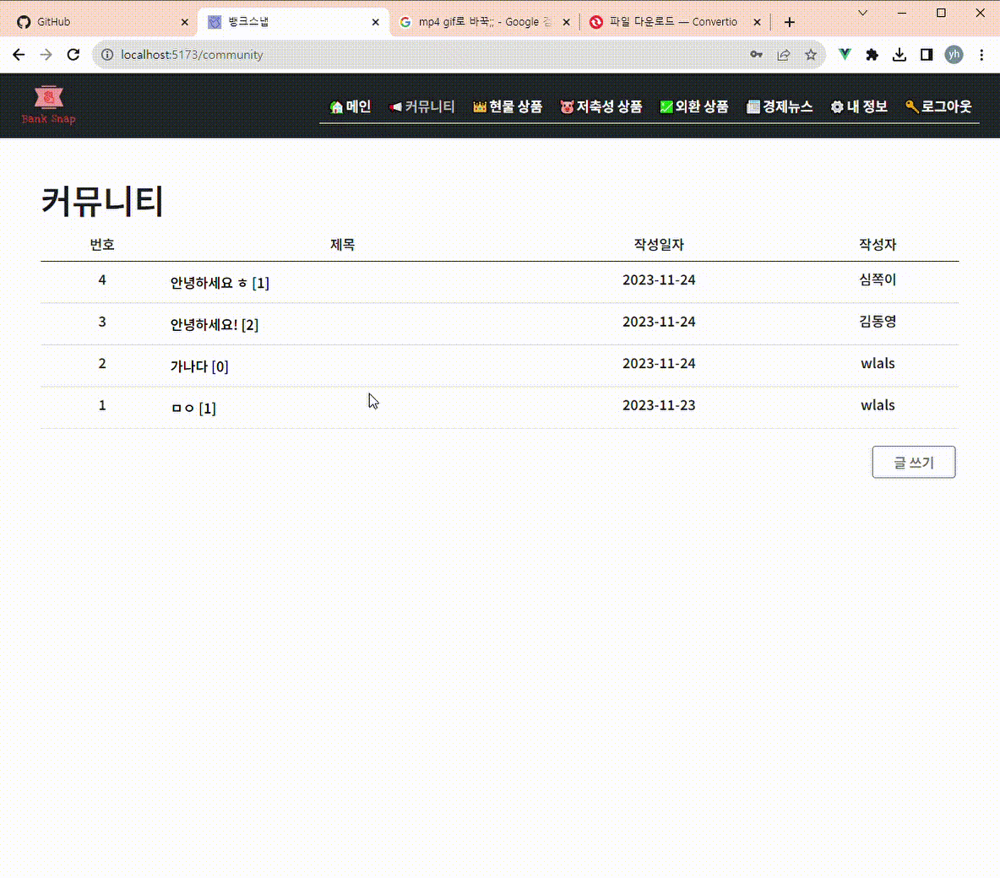
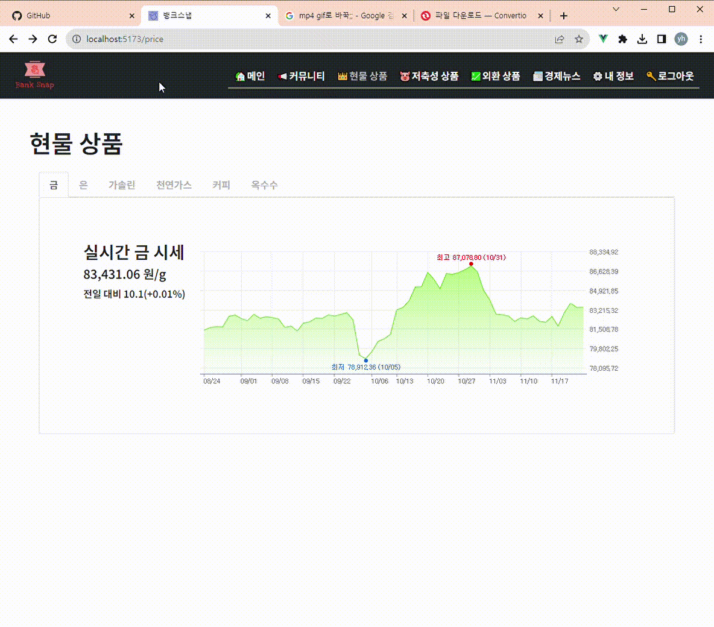
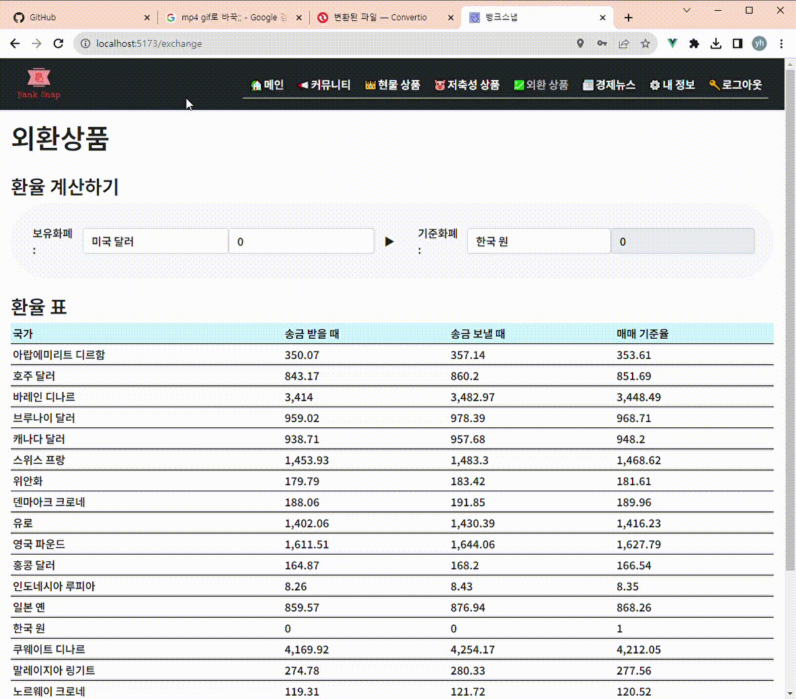

<body>

</body>

[toc]

# Bank Snap 🏦

💰 본 프로젝트는 **삼성 청년 SW 아카데미** 1학기 관통 프로젝트 결과물입니다.

​	 	 

## **개요🌱**

- 금융상품정보 웹 애플리케이션
- 예적금상품조회, 환율계산, 은행 검색, 커뮤니티 기능을 제공
- 투자성향에 따른 금융상품추천

​	 	 

## Team 😀

- |                      장지민(도자기.VER)                      |                      배영환(인생샷.PNG)                      |
  | :----------------------------------------------------------: | :----------------------------------------------------------: |
  |  |  |
  |                  https://github.com/jjm6604                  |              https://github.com/songjung-good/               |

  

   

   

## 프로젝트 기간💞️

### 진행기간

- 2023년 11월 16일 ~ 2023년 11월 24일 (9일)👋

  ### 세부내용

| 일시      | 진행내용                                                     | 특이사항                                                     | 비고                                                         |
| :-------- | ------------------------------------------------------------ | :----------------------------------------------------------- | :----------------------------------------------------------- |
| 11/14(화) | 1. 카카오맵 api를 이용한 은행 위치 검색 기능 구현 2. 수출입은행 api를 통해 환율계산기능 구현 3. vue 컴포넌트 구성  4. 프로젝트 레포 생성 | 1-1. XX+은행으로 검색하는 알고리즘(초기값 명지)  2-1. 환율계산기의 양방향 숫자 기입 기능의 문제 3-1 . 컴포넌트와 뷰의 기능의 차이에 대한 고찰 4-1. git desktop 이용 | 1-1-1. 필요시 변경예정 **1-1-2. 브라우저의 네비게이션 기능을 이용하라는 조언** 2-1-1. 한쪽에는 숫자를 기입, 다른쪽은 숫자 출력으로 기능 변경 3-1-1. (자료를 참고하자) |
| 11/15(수) | 1. 프로젝트 명, 프로젝트 로고 선정 2. 커뮤니티 페이지 구현(CRUD) 3. 회원가입, 로그인 기능 구현 4. 상단 바 네비게이션 구성 |  2-1. 커뮤니티의 게시글 수정 문제 3-1. 로그인기능구현 - 토큰을 통해 권한을 주는 동작이 정상작동을 하지 않았다  |  2-1-1. 게시글 수정 후 페이지에 바로 적용이 안되어서 새로고침되게 만듦 3-1-1. 코드에 오타가 있었다. |
| 11/16(목) | 1. readme 초기안 작성 2. DB구조 설계 3. 금감원api를 통해 은행 상품 정보 불러오기 4. 메인페이지 내용 설정 5. 네비게이션바 상단 고정, 페이지 화면 범위 수정 |  2-1. 회원정보와 은행정보를 얼마나 나눠야할지 고민 2-2. 예적금 상품을 연결한 키 설정 3-1. 상품정보란 하위에 예금, 적금을 넣을 지 고민 4-1. 메인페이지에 경제관련 뉴스 5-1. app.vue에 전역범위로 body를 범위를 설정 |  2-1-1. 기본회원정보/ 추가회원정보(금융상품추천)/ 은행명/ 은행상품으로 구분 2-2-1. 상품키와 예치기간을 기준으로 연결 3-1-1. 예금 적금란을 따로 구분하여 금융상품 하위에 적용 4-1-1. 네이버검색 API 이용  |
| 11/17(금) | 1. 메인페이지 naver api 통해 경제뉴스 2. user테이블 구조 수정 3. 은행상품데이터 출력 4. 환율계산기, 금리비교, 메인페이지 디자인 수정 5. 은행찾기 지역별 검색으로 수정  | 1-1. api 요청에서 오류가 있었다. 1-2. 메인페이지 내용추가가 필요  3-1. DB내용 재설정 3-2. 18시 이후 API서버 점검예정 4-1. 조금씩 나아지는 중 5-1. 지역데이터 json파일을 이용함 | 1-1-1. 코드리뷰 3시간만에 찾아낸 오류 : 두가지 코드 중 하나에 키 값이 누락되었다....  1-2-1. 사진자료 등을 추가  3-1-1. 은행상품 데이터에서 은행명은 외래키로 받아오는 것으로 변경 3-2-1. json파일로 데이터 저장하여 사용 |
| 11/18(토) | 1. 로그인 인증권한 수정  2. 마이페이지 공부하기  3. 금융상품 상세페이지  4. bootstrap 템플릿 적용하기 5. 계산 파일 수정 |  2-1.  6주차 프로젝트 자료 참고 2-2. 작성게시글 및 댓글 확인 3-1. 상세페이지의 내용이 이해에 어렵게 구성되어있음 4-1.  UI 구현하는 작업 5-1. 시간을 금요일 날짜로 고정 시켜둠 |    4-1-1. 기능이 구현된 코드위에 디자인을 입히는 작업이 어려웠다. 5-1-1. 주말에는 환율자료를 받아오지못해서 조정이 필요했다. |
| 11/19(일) | 1. 관심상품 등록 기능 추가 2. 마이페이지 기능 구현 3. vuetify / bootstrapvue 적용 | 1-1. 버튼 누를 시에 마이페이지에 상품 추가  2-1. 마이페이지로 인해 메인페이지 로딩이 안됐어요 ㅠㅜㅠㅠㅠ 3-1. 적용 포기 |  2-1-1. 기존에 등록된 사용자 (가져올 데이터가 없거나) or 등록되지 않은 사용자 3-1-1. 이미 들어간 코드에 영향을 줌 3-1-2. 예시 코드가 vue2 혹은 typescript가 많고 이식시키는데 어러움을 느낌  |
| 11/20(월) | 1. 개인정보 입력란 추가 2. 디버깅 3. 로그인, 회원가입 페이지 디자인 수정 | 1-1. 해당 입력 값을 통해 금융상품 추천 예정 2-1. 메인페이지가 보이지 않는 오류 2-2. 로그인이 되지 않는 오류 3-1. bootstrap을 적용 | 2-1-1. 마이페이지 기능이 추가되고 생겼었고 '로그인 시' 보이도록 수정 2-2-1. 마이페이지를 끄고 로그인 후 다시 작동을 시킨다. 2-2-2. HTML쪽 코드가 script의 코드보다 빠르게 진행되어 생기는 오류로 추측 2-2-3. 해당 오류는 life cycle 과 local에 입력데이터를 저장하는 방법 등으로 해결예정 |
| 11/21(화) | 1. 방향수정 2. 크롤링으로 금 / 유가 / 부동산 시세 받아오기 3. 게시판 정리  4. 메인 페이지 정리  | 1-1. 기존에는 기능 구현에 힘썻다면 컨셉을 적용 2-1. 부동산은 네이버부동산을 이용하여 지도를 통해 주변 시세확인 2-2. 금/ 유가 크롤링해오기 3-1. 게시판 디자인 수정 4-1. 메인페이지의 뉴스를 옮김 | 1-1-1. 다양한 종류의 상품을 볼 수 있게 수정 1-1-2. 바꾸는  김에 로고도 변경 1-1-2. 질문을 통해 상품 추천 2-1-1. 네이버 부동산 api가 있었는데 없어졌다.  2-1-2. 부동산 포기 2-2-1. 크롤링을 막아둔 사이트가 많아서 다양한 시점을 보여주기 실패 |
| 11/22(수) | 1. 위치기반 은행검색 기능구현 2. 상품페이지/ 내정보페이지 디자인 수정 3. 경제뉴스 페이지 영상자료 추가 4. 내 정보 수정 오류 발견 | 1-1. 상품을 고르면 해당상품 은행 검색이 될 수 있게 변경  3-1. youtube api이용해서 경제 관련 영상 추가 4-1. 정보 수정시 저장해야하는 back주소를 못찾음 | 3-1-1. 코드오류가 있었다. 불러오는 주소값이 잘못되었다. 4-1-1. 기본 은행정보(미선택)를 미리 저장하지 않아 데이터를 찾을 수 없어 발생했던 문제 |
| 11/23(목) | 1. 투자상품 추가 2. 설문을 통한 상품추천           | 1-1. 저축은행 예/적금 상품 추가, 크롤링 정보(옥수수) 추가  2-1. 개인 투자 성향 설문 조사를 통한 맞춤 상품 추천 |                                                              |
| 11/24(금) | 1. PPT 준비 및 발표                                         |                                                              |                                                              |

    

## 개발 환경 👀

   
  
  
  
  
   
   
   
  
  
  

- window10
- python: 3.9.13
- JavaScript: es6++
- Django: 4.2.7
- Vue: 3.3.8
- bootstrap: 5.3.1 
- Node.js 20.9.0
- Pinia 2.1.7

​	 	 	

## 협업 툴 👊

- Notion

- Mattermost

- github

    

## ERD 🌐

     

## 아키텍쳐♟️

## 웹페이지 🕸️

### 0. 구조

[웹페이지 구조 알아보기](./doc/구조/웹페이지구조.pptx)

### 1. 메인페이지

​	✔️네비게이션바를 통해 페이지 탐색 가능

​	✔️설문탭을 통해 투자성향조사

### 2. 회원가입

​	✔️ 한/영, 숫자 아이디 - 숫자/특수문자/영어 비밀번호 로 회원가입

### 3. 내 정보

​	✔️ 작성 글 / 작성 댓글 / 선호 상품 확인 가능

​	✔️ 나이 / 연봉 / 선호은행 / 투자성향 / 보유금액 기입가능

### 4. 커뮤니티

​	✔️ 글 작성 / 글 수정 / 글 삭제 / 댓글 작성/ 댓글 삭제 가능

	

### 5. 현물 상품

​	✔️ 크롤링을 통한 금/은/가솔린/천연가스/커피/옥수수 가격 확인

​	✔️ 실시간 가격과 3개월분 가격 추이 확인 가능

### 6. 저축 상품

​	✔️ 금융감독원 api를 이용하여 예적금 상품 데이터 저장

​	✔️ 상품 페이지를 통해 상세정보확인과 관심상품 등록가능

​	✔️ 카카오맵api와 geolocation 사용자 위치기반 인근 은행 검색가능

### 7. 외환상품

​	✔️ 한국수출입은행 api를 이용하여 실시간 환율 데이터 반영

​	✔️ 보유화폐와 기준화폐의 환율 계산 기능 제공

### 8. 경제뉴스

​	✔️ 네이버검색 api를 이용하여 경제기사 확인가능

​	✔️ youtube api를 이용하여 경제연관 영상 시청가능

​	 	 
